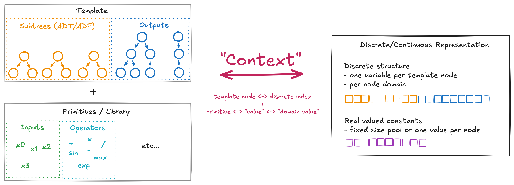
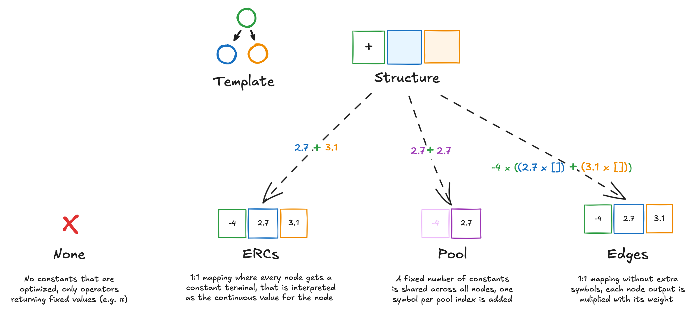

# goblin: GOMEA Optimization & Benchmarking Library with INterface

> [!WARNING]
> 🚧 Note: Currently the documentation is very much non-existent as the project isn't anywhere close to being mature yet - if you have questions, make an issue and assign Johannes Koch (or ask in person, but having questions noted somewhere would be nice for improving the documentation in the future)

GOBLIN (working title) is a C++ library with Python bindings for working with GOMEAs (Gene-pool Optimal Mixing Evolutionary Algorithms), in particular for symbolic regression. It aims to:

- simplify getting up and running when it comes to using GOMEAs in the following domains:
  - Single & multi-objective discrete, real-valued and mixed optimization
  - [Genetic programming (GP)](http://www0.cs.ucl.ac.uk/staff/W.Langdon/ftp/papers/poli08_fieldguide.pdf), in particular [symbolic regression (SR)](https://arxiv.org/pdf/1904.02050)
- provide basic utilities for standard benchmarking experiments, i.e. for test functions, logging and analysis (work in progress, see `examples/python/playground` for more information)

# Why GOMEA?

1. Linkage
2. Gray-box optimization with partial evaluations (well, not for SR and this repository is a leaky abstraction over the [official GOMEA library for that setting](https://github.com/CWI-EvolutionaryIntelligence/GOMEA))
3. Intron awareness (work in progress)

## Algorithms included

Mainly to ensure implementation correctness by comparing the performance to reference versions, but also to make using these algorithms more convenient, multiple other algorithms are included next to a mixed discrete continuous version:

- [AMaLGaM](https://homepages.cwi.nl/~bosman/publications/2013_benchmarkingparameterfree.pdf)
- [Discrete](https://arxiv.org/pdf/2109.05259), [real-valued](https://ir.cwi.nl/pub/26553/GECC1115.pdf) and [gene-invariant GOMEA](https://arxiv.org/pdf/2506.15222) from https://github.com/CWI-EvolutionaryIntelligence/GOMEA
- [Multi-objective binary GOMEA](https://homepages.cwi.nl/~bosman/publications/2018_multi-objectivegene-pooloptimal.pdf)
- Mixed discrete-continuous GOMEA (work in progress), a mix of [GAMBIT](https://ir.cwi.nl/pub/26653/2017_aparameterlessmodelbased.pdf), [GP-RV-GOMEA](https://ir.cwi.nl/pub/34425/paper_115.pdf), [MO GOMEA](https://homepages.cwi.nl/~bosman/publications/2018_multi-objectivegene-pooloptimal.pdf), [RV-GOMEA](https://ir.cwi.nl/pub/26553/GECC1115.pdf), this [adaptive grid archive](https://homepages.cwi.nl/~bosman/publications/2012_elitistarchivingfor.pdf) and other related publications

To track and compare optimization progress, the fitness evaluation can be intercepted similar to how benchmarking is done in [COCO](https://coco-platform.org/). This allows all methods to not care about progress reporting, and enables any desired resoluton in terms of evaluations done, time spent or generations performed (if supported by the algorithm) while providing a unified logging format across algorithms. See `examples/python/playground` for how benchmark experiments could look like.

# Python Quickstart

The Python bindings can be installed via `pip install -v .` (or via the corresponding `pip install git+...` command), but the recommended way to get started is with [`uv`](https://docs.astral.sh/uv/).

```python
# example.py
from sklearn.model_selection import train_test_split
from sklearn.datasets import load_diabetes
from sklearn.metrics import r2_score

from pygom import AMaLGaM, BenchmarkInstance, Sphere, Budget
import pygom.gp as gp

def sr_example():
    X, y = load_diabetes(return_X_y=True)
    X_train, X_test, y_train, y_test = train_test_split(X, y)

    est = gp.SymbolicRegressor(
        linear_scaling=True,
        budget_kwargs=dict(
            max_time_seconds=5,
        ),
        ims_kwargs=dict(initial_population_size=512, max_num_populations=1),
        rv_kwargs=dict(enabled=False), # disable rv optimization
        population_kwargs=dict(
            gradient_step_frequency=1 # do gradient optimization after every generation
        ),
        discrete_model_kwargs=dict(
            merge_continuous=False,
            num_continuous_bins=25,
            normalize_initial_linkage_bias=True,
        ),
    )

    est.fit(X_train, y_train)

    r2_train = r2_score(y_train, est.predict(X_train))
    r2_test = r2_score(y_test, est.predict(X_test))

    print("Best expression:", est.model)
    print("R2 train:", r2_train)
    print("R2 test:", r2_test)

def rv_example():
    sphere = BenchmarkInstance(Sphere(5))
    sphere.register_target([1e-8])
    sphere.set_initial_bounds(100.0, 110.0)

    budget = Budget(max_evaluations=10_000)

    alg = AMaLGaM()

    archive, status = alg.run(sphere, budget)

    print("Best solution:", archive[0].continuous_values())
    print("Best fitness:", archive[0].quality().objectives)
    print("Target value reached:", sphere.target_reached(archive))

if __name__ == "__main__":
    sr_example()
    rv_example()
```

Run with `uv run example.py` - this should automatically resolve all dependencies and build the Python bindins before running the above example.

Note that after the initial installation of the dependencies (implicitly done when running any script), you can pass the `--offline` flag or set the envirnment variable `UV_OFFLINE=1` to avoid network requests when working offline.

Also, either changing the version in `pyproject.toml` or running `uv cache clean` forces `uv` to reinstall the bindings (if the C++ code changed, `make bindings` might also be needed).

# C++ Quickstart

First, ensure `make`, `cmake` and C/C++ compilers supporting C++23 (for `std::span` and `std::unreachable`) are installed. The tools `ninja`, `ccache`, `mold`, `clang-format`, `clang-tidy`, `include-what-you-use` are also recommended.

For code examples see `lib/tests` for now.

```bash
# builds all CMake targets
make build

# runs all tests
make test

# updates the Python bindings (needed when the C++ api changes)
make bindings

# run all tests, but this time use another compiler/linker combination (currently the default linker and compilers are used, ninja and ccache are automatically detected and preferred)
# ! you will have to do a clean build when changing the linker again !
CC=clang CXX=clang++ LDFLAGS="-fuse-ld=mold" make clean test
# readelf -p .comment ./build/lib/tests/lib_test_amalgam | grep -i 'ld'
#   [    a0]  mold 2.40.4 (compatible with GNU ld)
CC=clang CXX=clang++ LDFLAGS="-fuse-ld=lld" make clean test
# readelf -p .comment ./build/lib/tests/lib_test_amalgam | grep -i 'ld'
#   [    72]  Linker: LLD 21.1.6 (https://github.com/conda-forge/llvmdev-feedstock 9995b55f2772fa2c2d48102a3ac35919050fed84)
CC=gcc CXX=g++ LDFLAGS="-fuse-ld=mold" make clean test
```

The `Makefile` also defines other commands to work with the code, so check that out, and how the Python bindings are generated is documented [here](pylib/README.md).

Again use `UV_OFFLINE=1 make <x>` when offline.

### Environment setup using `conda`

Turns out relying on C++20/23 features isn't very portable yet, especially on systems without sudo rights. A workaround is to use [`conda`](https://www.anaconda.com/docs/getting-started/miniconda/install#linux-2) to setup an environment containing everything needed to work with the project:

```bash
# create an environment with the recommended toolchain
conda create -n goblin python=3.12 \
    conda-forge::gcc">=15" \
    conda-forge::gxx">=15" \
    conda-forge::clang">=20" \
    conda-forge::clangxx">=20" \
    conda-forge::clang-tools">=20" \
    conda-forge::mold \
    conda-forge::lld \
    conda-forge::ninja \
    conda-forge::cmake \
    conda-forge::ccache \
    conda-forge::libxslt \
    --solver=libmamba
    
# libxslt is needed by srcml, the C++ parser used by litgen to generate the Python bindings

# activate the environment
conda activate goblin

# now everything should work

# deactivate the environment
conda deactivate
```

Alternatively, here is the `environment.yaml`

```yaml
name: goblin
channels:
  - conda-forge
  - defaults
dependencies:
  - conda-forge::ccache
  - conda-forge::clang-tools[version='>=20']
  - conda-forge::clang[version='>=20']
  - conda-forge::clangxx[version='>=20']
  - conda-forge::cmake
  - conda-forge::gcc[version='>=15']
  - conda-forge::gxx[version='>=15']
  - conda-forge::libxslt
  - conda-forge::lld
  - conda-forge::mold
  - conda-forge::ninja
  - python=3.12
```

## GP/SR Implementation Details

> [!NOTE]
> This part of the documentation should be expanded and moved somewhere else, but for now some useful details about the GP/SR support are here.

Compared to the [original GP-GOMEA implementation](https://github.com/marcovirgolin/GP-GOMEA), no distinction is made between GP and general purpose mixed optimization as described in the [GAMBIT paper](https://ir.cwi.nl/pub/26653/2017_aparameterlessmodelbased.pdf).

### Internal representation

The GOMEA versions used here either handle discrete, real-valued or both domains. However, in GP/SR, the solutions encode programs or expressions consisting of variables, functions, etc. and a mapping between the actual domain and a discrete and continuous representation is required. This mapping is defined in the [`GPContext`](lib/include/goblin/gp/context.h) and roughly works as follows:

- The structural search space of programs/expressions is defined by a _template_, a set of trees
- The set of all possible variable values is a user defined set of privmitives, where each primitive is mapped to a discrete integral _value_. Each value has additional information such as the _kind_ (e.g. a input variable or a function) and _arity_ (number of parameters the primitive can take in).
- The context maps each node in the template to a list index. Since each node is a tree node, additional information such as the depth, height, number of children, the set of indices making up the subtree rooted at the node etc. is also stored for each such index.
- For each node, the subset of values admissible for the node is computed as the node _domain_. For example leaf nodes cannot take on primitives with a non-zero _arity_. Both the mapping from the node _domain_ to the corresponding _value_ and the inverse are stored in the context.
- The optimizer can be oblivious to the underlying representation used, as it only needs to deal with discrete and continuous variables. All information about how to interpret solutions as programs/expressions is provided by the "problem instance", and downcasting a general `InstanceBase` object to a `GPInstanceBase` would allow the algorithm to define special mechanisms specific to GP.
- To evaluate the program/expression, it typically needs to be executed/interpreted. To do so, the `GPContext` provides a routine that traverses and interprets the conceptual tree structure defined by the template in-order based on the stored lookup tables.



Note that different evaluation paradigms are possible, e.g. a first step could be traversing the expression tree to extract a sequence of instructions in reverse polish order (resolving any subtree references) before the tree is interpreted. How expressions are represented could also be completely changed to e.g. do cartesian genetic programming (https://link-springer-com.tudelft.idm.oclc.org/chapter/10.1007/978-3-031-14721-0_2) by implementing an alternative "context".

### Introns, initialisation and linkage

For solutons representing expressions smaller than the full template, there are unused variables that do not affect the expression semantics called *introns*/*conditionally inactive variables*.
Which variables are inactive is known - all variables not visited when evaluating the expression are inactive. Knowledge about which variables are active is used by GOMEA in two ways:

- changes that only affect inactive variables are not evaluated
- both in discrete and continuous optimization, the linkage learning/distribution updates can exploit this by not considering inactive variables. Inactive variables are potentially noisy - since the values are not subject to selection pressure, there is no guarantee that these values are useful building blocks even if the solution is of above average quality.

Initialization has an impact on the distribution of introns in the initial population, but also on the linkage learning based on mutual information:

- For example the grow initialization method (= uniformally random initialization with the chosen representation) samples each node from the full domain (both terminals and non-terminals), so with increasing node depth, the chance of the node being initially inactive increases.
- Since the initial distribution of values is not remotely uniform with some of the typical initialisation methods, this can suggest spurious linkage (i.e. the data suggests linkage but there is none) and this initial bias can be corrected as per https://arxiv.org/pdf/1904.02050. It is unclear if this is beneficial when combined with intron aware linkage learning.

### Constant representations and optimization

Expressions consist of both **structure** and real-valued **constants/coefficients/parameters/weights** [^1]. There are different ways to represent those values, the main ones being ERCs and the pool representation [^2]:



There are different forms of constant optimization available:

- no optimization (i.e. only recombination of the initially sampled values using operators)
- mutation (as per https://ir.cwi.nl/pub/32043/32043.pdf)
- gradient based optimization (as per https://ir.cwi.nl/pub/33310/33310.pdf, or rather the yet unpublished follow up from Joe)
- joint model based evolution (as per https://ir.cwi.nl/pub/34425/paper_115.pdf)

Finally, there are also multiple ways to handle constants during the discrete linkage learning:

- `num_continuous_bins > 0`: bin constants into groups based on their value (as per https://arxiv.org/pdf/1904.02050)
- `merge_continuous = True`: consider only that the variable is a constant, not what the value is (essentially "is-const" in the terms of the above paper)
- `merge_continuous = False` and `num_continuous_bins = None`: (for the pool representation) all pool indices are treated as separate discrete symbols, completely ignoring that those are real-valued

[^1]: I tend to go with constants, as the function class approach adds non-constant parameters that need to be fitted at prediction/inference time) but there is no consensus in literature.

[^2]: Most problems need constants making _none_ not an option and the _edges_ representation is generally a bad idea for interpretability and overparameterized expressions with too many constants are harder to optimize (https://doi.org/10.1145/3583131.3590346).

### Automatically Defined Trees/Functions

Understanding larger equations or computer programs is tractable due to decomposition - isolated concepts and subroutines can be understood separately and avoid repetition. Something along those lines is what Koza, the grandfather of GP, called automatically defined trees/functions (ADTs/ADFs). For GP-GOMEA, this idea was explored in https://arxiv.org/pdf/2505.01262v1 and is also implemented in this version. Conceptually there is a hierarchy of subtrees/subfunctions that output trees can refer to, where the hierarchy is needed to avoid cycles. Repeated calling of subfunctions can drastically increase the expression size, hence there is a `max_expression_size` parameter to limit this and allow pre-allocating buffers internally needed to store intermediate results during evaluation.

### Function class learning

> [!CAUTION]
> This currently is not supported yet!

The idea is that in some settings there is not a single dataset, but multiple observations/views/local sets that are recording the same relationship but under different conditions (e.g. same tumor, but different patients with different tumor locations etc; some more examples are in https://arxiv.org/pdf/2509.10500) as described in https://ir.cwi.nl/pub/34531/34531.pdf. This concept is also called multi-view symbolic regression (e.g. in https://arxiv.org/pdf/2402.04298).

Compared to the typical regression setting, the input is a set of datasets and there are new symbols corresponding to free numerical parameters that need to be fitted to each dataset independently. Hence the support for `ValueKind::Parameter`.


### Strongly Typed GP

> [!CAUTION]
> This isn't even remotely supported yet.
