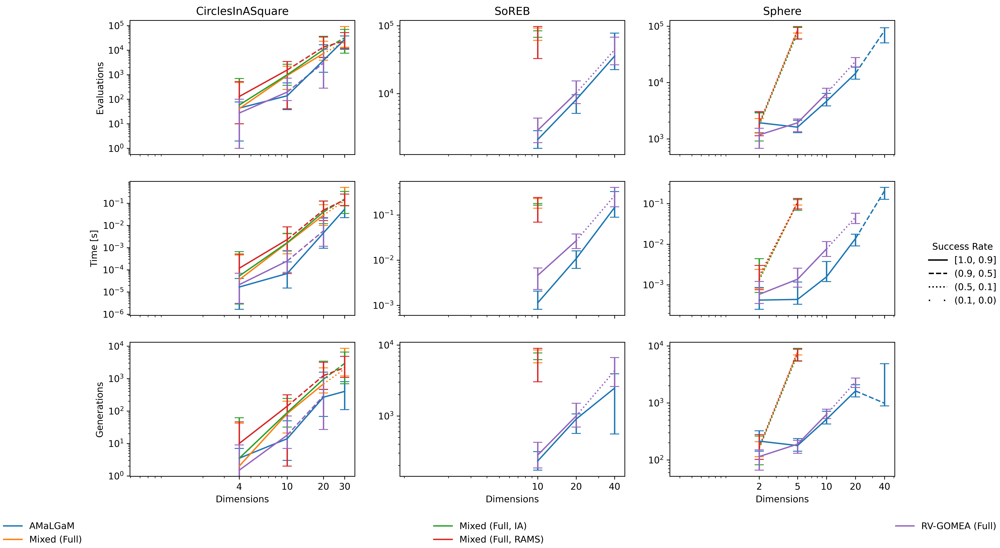
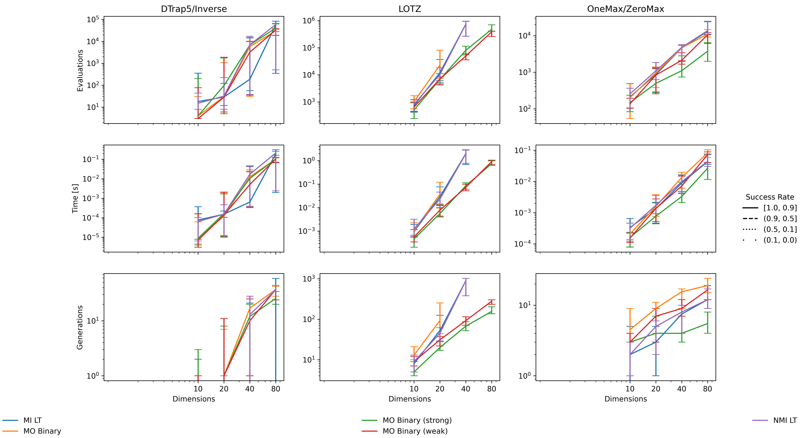

# A playground for running comparison experiments

This example is both the comparison of the new mixed version to the baseline versions for various domains, and a playground where one candiate for the benchmarking API is evaluated. The following comparisons exist (at the time of writing this):

- `uv run continuous.py`: real-valued optimization with AMaLGaM, RV-GOMEA and the (at the point of writing this buggy) Mixed version
- `uv run discrete.py`: Binary discrete optimization with GOMEA, GI-GOMEA and the Mixed version
- `uv run mo_discrete.py`: Multi-objective comparison using the experiments and baseline version from https://homepages.cwi.nl/~bosman/publications/2018_multi-objectivegene-pooloptimal.pdf
- `uv run repr.py`: A mostly still non-sensical comparison of different internal representations of the population:
  - Array of Structs: the population is a vector of solution structs
  - Structs of Arrays: the population is several big matrices containing all solution values, individuals are just proxy handles to the correct offset (a column major and row major version exist)
  The hope is that the SoA style representation is faster, however, at this point none of the expensive operations across solutions (e.g. entropy calculation) have been specialized to enable vectorization so without experiments requiring large enough population sizes these experiments don't really show anything conclusive.

The experimenting setup currently includes

- config serialization
- experiment running
- result postprocessing (.csv -> .parquet for faster querying)
- basic scalability plot

in the `src` folder.

